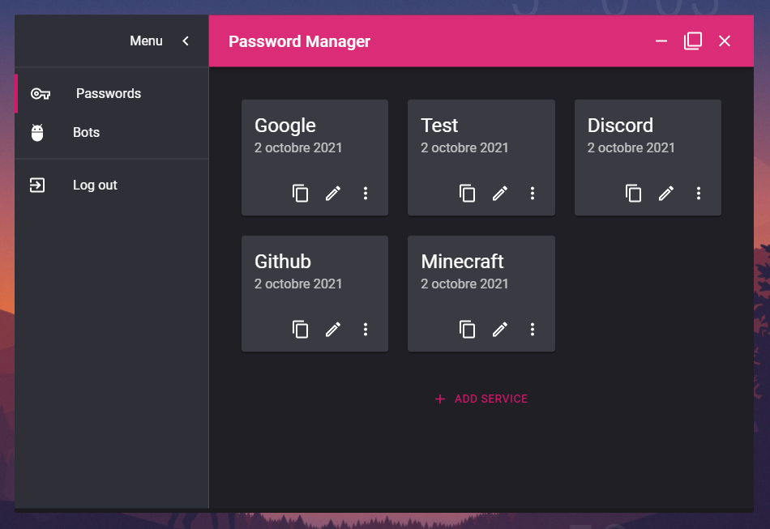

# PasswordsManager

Lightweight passwords manager where passwords are synchronized by saving password in a discord channel.

This project has been done mostly for learning purpose. There might be security issues, and the code is a hell. Also, it was my first time at using Typescript. The code is terrible, but I'm still proud of the result!

This repository is a fork of [Electron React Boilerplate](https://github.com/electron-react-boilerplate/electron-react-boilerplate).

## Install

First, go to the release page and download the zip file for your OS : [Releases](https://github.com/PixelDeEcran/PasswordsManager/releases)

Next, follow the installations instructions and here you have it!

## How to use it?

In order to get passwords, the application need a bot in order to use the Discord API. To do so, first create a bot and get his token, go check out this [tutorial](https://github.com/reactiflux/discord-irc/wiki/Creating-a-discord-bot-&-getting-a-token). Next, add your bot to your server and create a channel where your passwords will be saved. Finally, take note of the channel id (to get the channel id, right click on the channel, and 'Copy ID').

Now, launch the application. First, enter a secret key, this will be your main password and it will be used to find your others passwords. Please, be aware that if you lose your secret key, all the passwords will be lost. Now, you can click on the button 'Login'.


So first, you need to register the bot that you created. Go in the 'Bots' section on the left menu. Now click the 'Add Bot' button, and enter the informations of the bot, and click the 'Add' button. You will normaly endup with that :


Now, you can go to the 'Passwords' section. You can click 'Add Service' (a service can contains more informations than just a password) and enter the passwords you want to save. You can also edit them, copy the passwords, and delete some.



## Clone this repository

Just clone this repository, and run this command to start the application:
```
yarn start
```

You can also package the application by simply doing: 
```
yarn package
```
